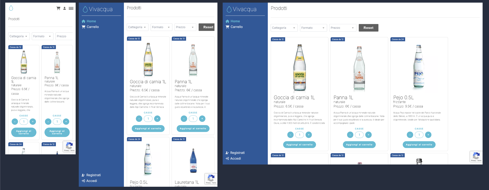

# 🛍 Ecommerce Frontend (Vue 3)

Questo progetto è il frontend di una piattaforma e-commerce realizzata con **Vue 3** e **Vite**. L'interfaccia è responsiva e ottimizzata per l'esperienza utente, con supporto per login, visualizzazione prodotti, gestione carrello e pagamenti.

---

## 📷 Screenshot

### 🖥 Home page

## 🧰 Tecnologie utilizzate

- **Vue 3** con **Composition API**
- **Vite** per build e sviluppo veloce
- **Pinia** per gestione dello stato globale
- **Vue Router** per navigazione client-side
- **JavaScript** + **CSS**
- **Fetch API** per comunicazione con backend
- **.env** per gestione variabili ambiente
- **Responsive Design** per desktop e mobile

---

## 🧩 Funzionalità principali

### 🧑‍💼 Autenticazione utente

- Login utente e gestione token JWT
- Visualizzazione stato autenticazione
- Riattivazione utente disattivato (funzione `ReactivateUser`)
- Logout e controllo accessi frontend

### 🛒 Carrello e pagamenti

- Aggiunta e rimozione prodotti dal carrello
- Calcolo totale e quantità
- Salvataggio stato del carrello
- Supporto per pagamento (Stripe lato backend)

### 🧱 Prodotti e interfaccia

- Visualizzazione dinamica dei prodotti (con `CardProduct.vue`)
- Ricerca e filtro prodotti (funzionalità lato store)
- Immagini ottimizzate (funzione `resizeImage`)
- Componenti modulari: `Main`, `Cart`, `CartItem`, `Footer`, ecc.

### 🌐 Integrazione con backend

- Connessione API per login, dati utente, prodotti, pagamento
- Gestione errori e messaggi utente lato frontend
- Stato sincronizzato tramite Pinia store (`storeCart`, `storeAuth`, `storeProducts`, ecc.)

---

## 📄 Note aggiuntive

- Il progetto è pensato per lavorare a fianco del backend Express/MongoDB.
- Le immagini e i dati sono caricati da endpoint REST esposti dall’API backend.
- Il design è minimale e modulare, facile da estendere con nuove pagine o funzionalità.
